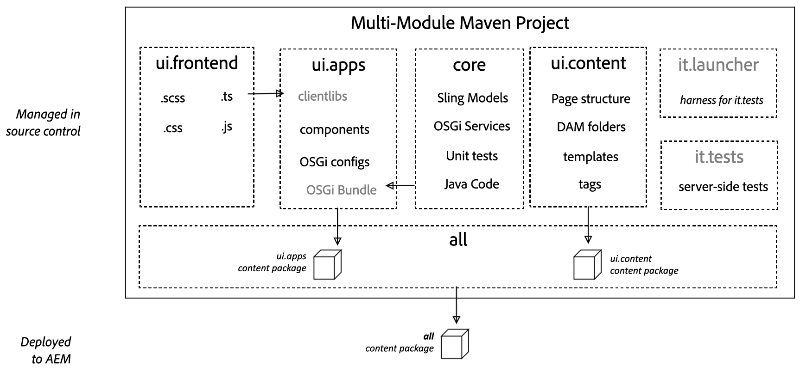

# AEM Project Archetype

The AEM Project Archetype creates a minimal, best-practices-based Adobe Experience Manager project as a starting point for your own AEM projects. 

Using the AEM Project Archetype sets you on the path towards building a best-practices-based AEM project with just a few keystrokes. 

By using the archetype, all of the pieces will already in place so that while the resulting project is minimal, it already implements all of the key features of AEM so that all you have to do is build on top and extend.

 
 

# The AEM Archetype is made up of modules:

* core: is a Java bundle containing all core functionality like OSGi services, listeners, and schedulers, as well as component-related Java code such as servlets and request filters.
* it.tests: are Java-based integration tests.
* ui.apps: contains the /apps and /etc parts of the project, i.e. JS and CSS clientlibs, components, and templates.
* ui.content: contains sample content using the components from the ui.apps module.
* ui.config: contains runmode-specific OSGi configs for the project.
* ui.frontend: (optional) contains the artifacts required to use the front-end build module (general/react/angular).
* ui.tests: contains Selenium-based UI tests.
* all: is a single content package that embeds all of the compiled modules (bundles and content packages) including any vendor dependencies.

 

# Usage

To generate a project, adjust the following command line to your needs:

* Set aemVersion=cloud for AEM as a Cloud Service;
* Set aemVersion=6.5.12 for Adobe Managed Services, or on-premise. The Core Components dependency is only added for non cloud aem versions as the Core Components are provided OOTB for AEM as a Cloud Service.
* Adjust appTitle="My Site" to define the website title and components groups.
* Adjust appId="mysite" to define the Maven artifactId, the component, config and content folder names, as well as client library names.
* Adjust groupId="com.mysite" to define the Maven groupId and the Java Source Package.

Lookup the list of available properties to see if there's more you want to adjust. https://github.com/adobe/aem-project-archetype

> mvn -B org.apache.maven.plugins:maven-archetype-plugin:3.2.1:generate \
 -D archetypeGroupId=com.adobe.aem \
 -D archetypeArtifactId=aem-project-archetype \
 -D archetypeVersion=39\
 -D appTitle="My Site" \
 -D appId="mysite" \
 -D groupId="com.mysite"

 

>mvn -B org.apache.maven.plugins:maven-archetype-plugin:3.2.1:generate -D archetypeGroupId=com.adobe.aem - D archetypeArtifactId=aem-project-archetype -D archetypeVersion=35 -D appTitle="AEM Learning Site" -D appId="learningsite" -D groupId="com.aem.learning" -D version="0.0.1-SNAPSHOT" -D aemVersion="6.5.12" -D frontendModule=none -D includeDispatcherConfig=n

