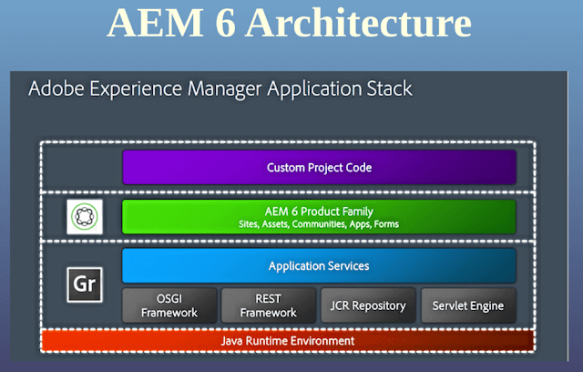

# Introduction

Adobe Experience Manager (AEM) is a web content management system with a wide array of powerful features.

With AEM you Author and publish websites. This is achieved using two specialized environments:

1. Author:
    Here you can enter and manage the content for your website.

2. Publish:
    This environment makes the content available to your intended audience.

 

## History

*****

AEM before it was called as CQ (Communiqué) it was part of Day Software.
Later, Day Software was acquired by Adobe Systems on 28 July 2010 for US $240 million.

From then and now Adobe is adding & enhancing it's features. And also Adobe is adding the it's existing creative suite to AEM.

 
 

## Architecture

*****

 

 

 

## Java Runtime Environment (JRE)

AEM is a Java based web application hence it requires server-side Java Runtime Environment (JRE).

## Granite Platform

It is Adobe's open web stack and it creats the technical base on which AEM is built. It also provides the foundation UI framework (Granite UI).

It provids various components including:

* An application launcher
* An OSGi framework into which everything is deployed
* A number of OSGi services to support building applications
* A comprehensive Logging Framework providing various logging APIs
* The CRX Repository implementation of the JCR API
* The Apache Sling Web Framework
* Additional parts of the current CRX product

## OSGI

OSGi defines an architecture for developing and deploying modular applications (it is also known as the Dynamic Module System for Java). OSGi containers allow you to break your application into individual modules (are jar files with additional meta information and called bundles in OSGi terminology) and manage the cross-dependencies between them.

An OSGi framework then offers you dynamic loading/unloading, configuration and control of these bundles - without requiring restarts.

## Sling

AEM is built using Sling, a Web application framework based on REST principles that provides easy development of content-oriented applications. Sling uses a JCR repository, such as Apache Jackrabbit, or in the case of AEM, the CRX Content Repository, as its data store.

 

## AEM Modules

On top of the above technology stack, there are AEM specific modules that run. These modules are *AEM Sites, AEM Assets, Workflows* etc.

 
 
 
 

## References

*****

1. <https://experienceleague.adobe.com/docs/experience-manager-65/developing/introduction/the-basics.html?lang=en>
